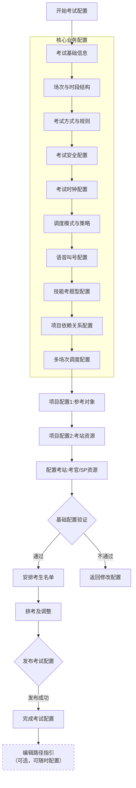
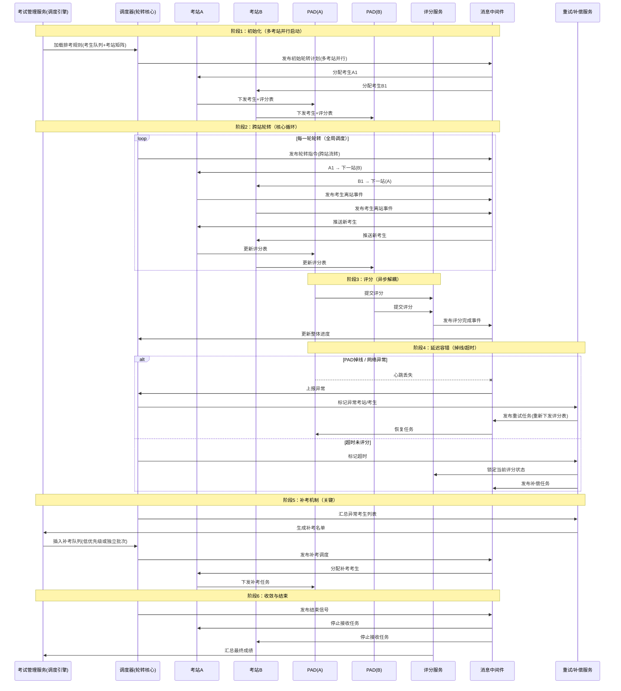
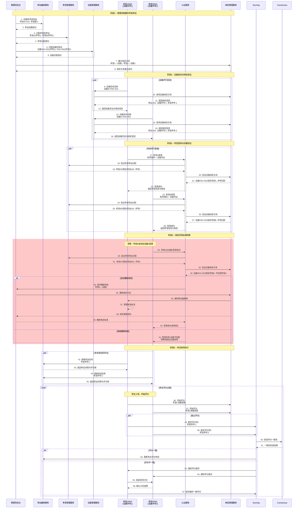

# osce
osce考试系统
一个完整的OSCE（客观结构化临床考试）考核系统通常包含以下核心服务模块：

1. 用户与权限管理服务

用户服务：考生、考官、管理员账号管理

认证服务：登录认证、单点登录、设备认证

权限服务：角色权限控制、操作权限验证

会话服务：登录状态管理、设备绑定管理

2. 考试编排服务

考试计划服务：考试场次安排、时间表管理

考站编排服务：考站顺序、轮转规则、时间控制

考生分配服务：考生分组、考站分配、轮转调度

考试模板服务：标准化考试模板管理

3. 考站执行服务

考站任务服务：当前考站状态、考生信息、倒计时

评分表服务：评分标准、评分项、权重配置

计时服务：考站倒计时、考试总计时、超时处理

多媒体服务：视频录制、音频采集、文件上传

4. 评分与评估服务

评分采集服务：实时评分提交、评分项验证

评分计算服务：自动计分、权重计算、总分统计

评估分析服务：成绩分析、通过率统计、能力评估

成绩单服务：成绩单生成、打印、导出

5. 设备与终端服务

设备管理服务：PAD设备注册、绑定、状态监控

终端应用服务：考官PAD应用、考生终端应用

设备同步服务：数据同步、状态同步、配置同步

离线缓存服务：网络异常时的本地缓存

6. 事件与消息服务

消息中间件：事件发布/订阅、实时通知

事件总线服务：系统事件路由、事件处理

通知服务：推送通知、短信通知、邮件通知

日志服务：操作日志、系统日志、审计日志

7. 数据与同步服务

数据同步服务：多端数据同步、冲突解决

数据归档服务：考试数据归档、历史数据管理

备份服务：数据备份、恢复

报表服务：统计报表、分析报表

8. 监控与管理服务

系统监控服务：服务健康检查、性能监控

异常告警服务：系统异常告警、业务异常告警

配置管理服务：系统配置、业务参数配置

运维管理服务：系统维护、数据清理

9. 第三方集成服务

考生信息集成：与教务系统、医院HIS系统对接

身份认证集成：与统一身份认证平台对接

视频监控集成：与监控系统对接

成绩发布集成：与成绩管理系统对接

10. 安全与合规服务

数据加密服务：数据传输加密、存储加密

访问控制服务：IP白名单、访问频率控制

合规审计服务：操作审计、数据变更审计

隐私保护服务：考生隐私数据保护

# OSCE考核系统多考官多设备架构设计

针对一个考站分配多考官和多设备的情况，需要建立考官序号与设备序号的精确对应关系。以下是完整的服务架构和交互流程：

核心服务模块
1. 考站编排服务

考站配置模块：定义考站考官数量、角色（主考/副考）

考官分配模块：分配具体考官到考站，指定考官序号

设备分配模块：分配设备到考站，指定设备序号

绑定关系管理：建立考官序号↔设备序号的映射关系

2. 设备管理服务

设备注册模块：设备唯一标识、设备类型、设备能力

设备分组模块：按考站分组设备，分配设备序号

设备状态监控：实时监控设备在线状态、电量、网络

设备绑定验证：验证设备与考官的绑定关系

3. 考官管理服务

考官信息管理：考官资质、专业领域、角色权限

考官考站分配：分配考官到具体考站，指定考官序号

考官设备绑定：建立考官与设备的动态绑定关系

考官状态跟踪：考官登录状态、评分状态、位置状态

4. 评分协同服务

评分任务分配：将评分项分配给不同考官

评分一致性校验：多考官评分的一致性检查

评分权重计算：不同考官评分的权重分配

最终成绩合成：综合多考官评分计算最终成绩

5. 实时协同服务

状态同步模块：多设备间状态实时同步

事件广播模块：考试事件向所有设备广播

冲突解决模块：处理多设备操作冲突

协同控制模块：主考官对副考官的控制权限

考官序号与设备序号绑定机制
绑定关系数据结构

## 多考官协同评分模式
1. 独立评分模式:考官1评分 → 考官2评分 → 系统自动计算平均分
2. 主副考官模式:主考官评分(权重70%) + 副考官评分(权重30%) = 最终成绩
3. 共识评分模式:考官1评分 → 考官2评分 → 差异超过阈值 → 考后由管理员在成绩编辑中修订

设备故障处理流程

设备离线检测：监控服务发现设备离线

自动切换：将考官切换到备用设备

数据同步：将原设备数据同步到新设备

通知管理员：报告设备故障，需要维护

数据一致性保证
1. 实时同步机制

操作日志同步：所有评分操作实时同步到所有设备

状态广播：考生状态、计时状态实时广播

冲突检测：检测多设备同时操作同一数据

2. 最终一致性策略

本地优先：网络异常时本地操作优先

异步同步：网络恢复后异步同步数据

版本控制：使用版本号解决数据冲突

人工干预：无法自动解决的冲突提示人工处理
