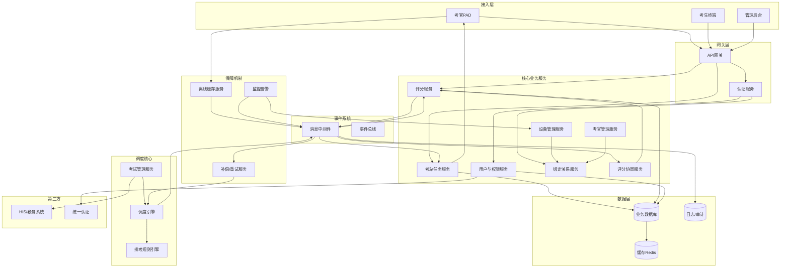
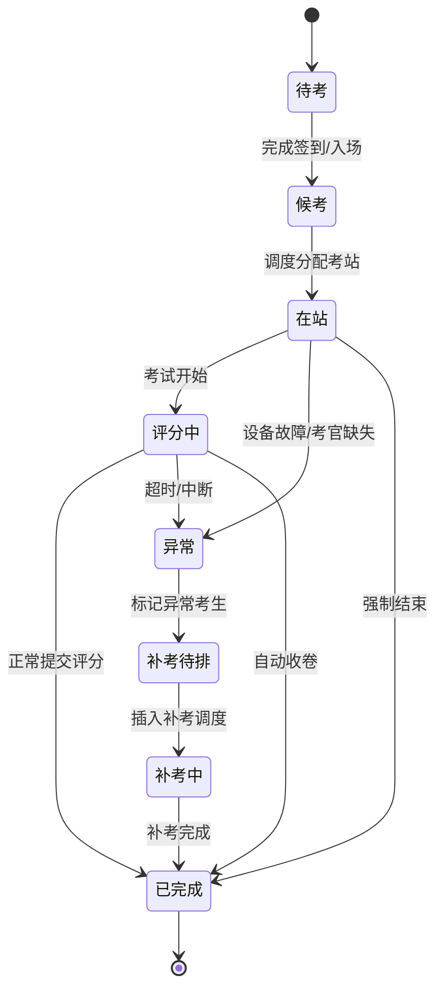
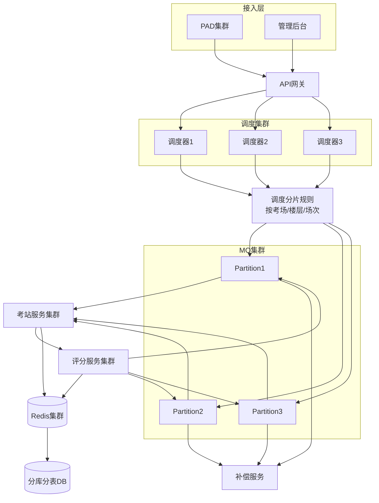
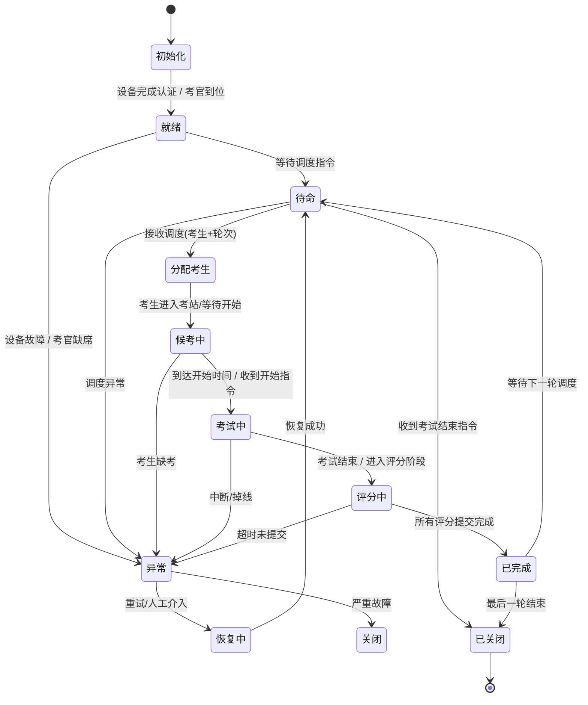

# 一、OSCE系统总体架构
🎯 “以调度引擎为核心，基于事件驱动的OSCE分布式考试系统”
核心三层：
接入层 → 业务服务层 → 调度与事件层 → 数据层

# 二、完整系统架构图

# 三、架构关键设计
## 1、调度引擎 = 系统大脑
职责：
轮转调度（跨站）
多考站并行控制
补考插入
异常处理触发

👉 本质：Scheduler = 状态机 + 队列 + 时间驱动
## 多考官多设备绑定
核心抽象：

考站
 ├── 考官序号 (1,2,3)
 └── 设备序号 (1,2,3)

绑定关系：
ExaminerIndex ↔ DeviceIndex

👉 强约束：登录必须“双因子匹配”（人 + 设备）

## 评分协同
支持三种模式：
| 模式   | 特点      |
| ---- | ------- |
| 独立评分 | 自动汇总    |
| 主副考官 | 权重计算    |
| 共识评分 | 冲突→协同解决 |

## 事件驱动（MQ是命脉）
所有核心动作都必须事件化：

考生入场
轮转调度
评分提交
考试开始/结束

👉 原则：

❌ 不允许“直接调用驱动流程”
✅ 必须通过 MQ 解耦

## 延迟容错
分三层：

✅ 设备层
心跳检测
自动重连
✅ 业务层
超时锁评分
标记异常
✅ 系统层
Retry补偿服务
幂等机制

## 重考机制
异常考生 → Retry收集 → ExamMgr生成补考计划 → Scheduler重新编排
👉 支持：插队、独立批次、单站补考

## 数据一致性
实时一致（弱一致）
MQ广播状态
最终一致（强保证）
评分入库
补偿重试

👉 技术手段：版本号、幂等ID、去重机制

# 🧠 图一：考生全生命周期状态机

# 高并发分布式调度架构

# 考站全生命周期状态机

