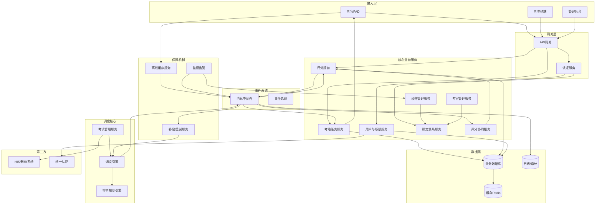
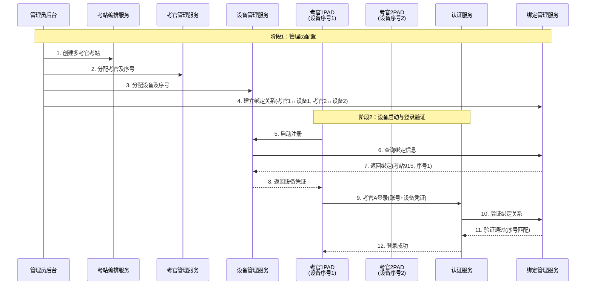
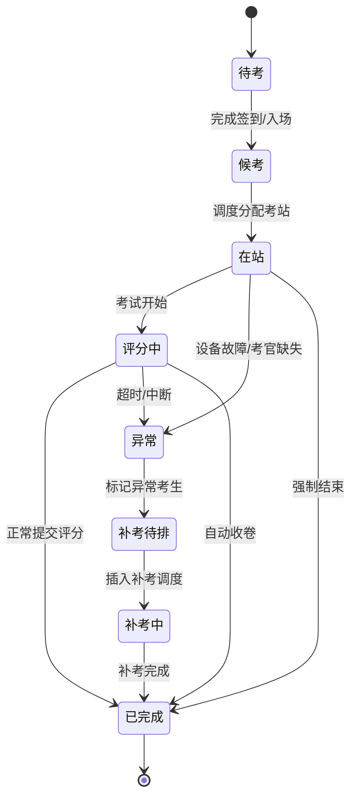
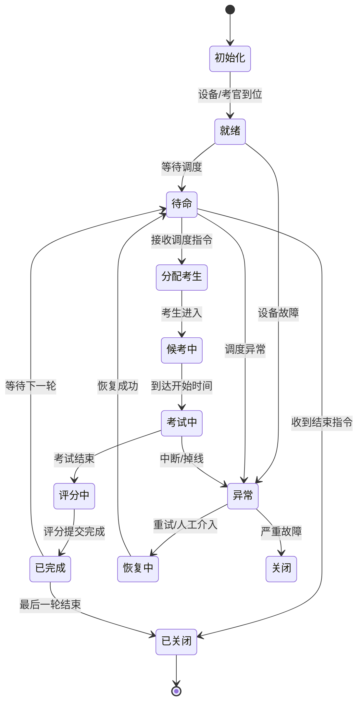
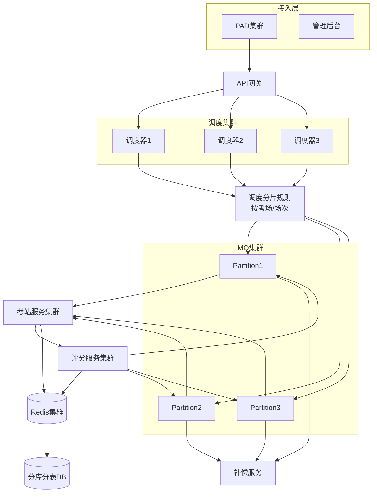
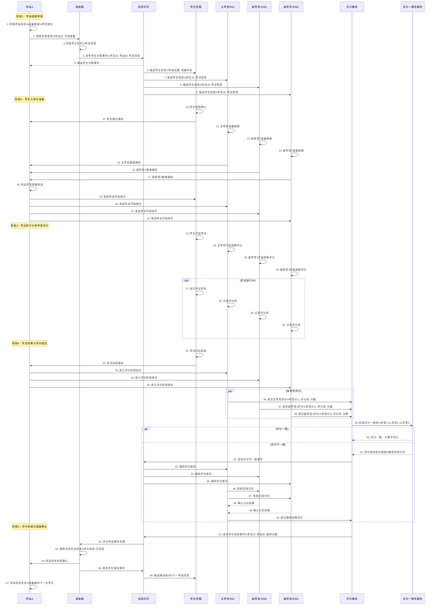
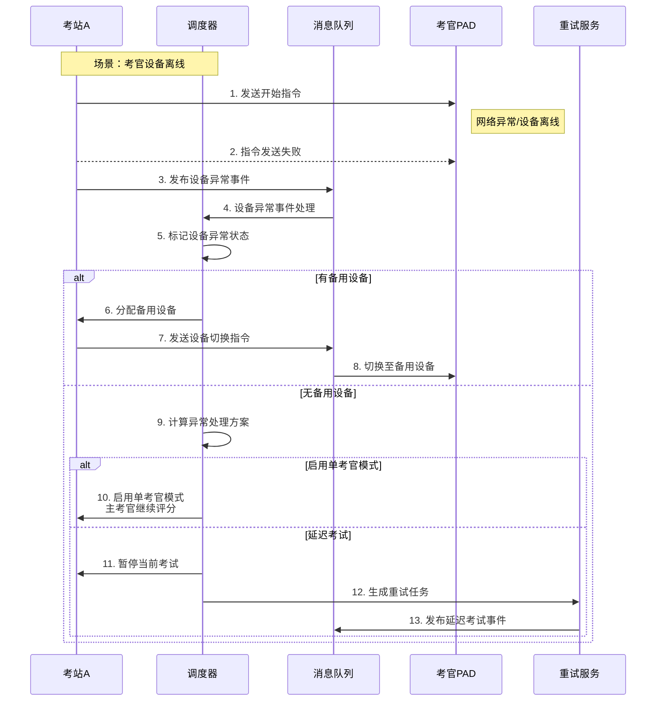
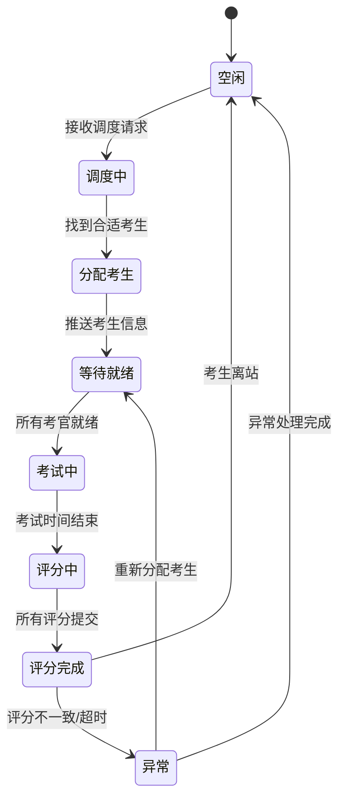

# OSCE考试系统项目说明文档

## 1. 项目概述

### 1.1 项目背景
OSCE（客观结构化临床考试）是医学教育中广泛使用的临床能力评估方法。本系统旨在构建一个**分布式、高并发、高可靠**的数字化OSCE考核平台，支持大规模、多考站、多考官的复杂考核场景。

### 1.2 核心目标
- **标准化**：统一考核流程与评分标准
- **高效性**：支持考生自动轮转、多考官协同
- **可靠性**：保障考试过程稳定，具备完善的异常处理与重考机制
- **可扩展**：支持未来功能模块与第三方系统集成

### 1.3 系统范围
涵盖从考试编排、考生调度、考站执行、多考官评分到成绩汇总的全流程数字化管理。

## 2. 总体架构设计

### 2.1 架构愿景
**“以调度引擎为核心，基于事件驱动的分布式考试系统”**。

### 2.2 核心架构图
系统采用清晰的分层架构，实现关注点分离和解耦。


### 2.3 核心设计理念
1.  **调度引擎为大脑**：集中管控全流程状态与流转。
2.  **事件驱动解耦**：通过消息中间件(MQ)连接各服务，实现异步、松耦合通信。
3.  **设备与考官强绑定**：确保评分责任到人，操作可追溯。
4.  **分层容错机制**：从设备、业务到系统层，均有完备的异常处理与恢复策略。

## 3. 核心组件详解

### 3.1 调度引擎 (Scheduler)
**职责**：系统的指挥中心。
- **轮转调度**：根据排考规则，驱动考生在多个考站间流转。
- **并发控制**：管理多考站并行考核。
- **异常调度**：触发并管理补考、重考流程。
- **时间驱动**：严格控制各考站计时与全局考试进度。

**本质**：一个由**状态机、队列和时间器**组成的核心控制器。

### 3.2 多考官多设备绑定机制
为支持一个考站内多位考官独立评分，需建立精确的考官与设备映射关系。

**核心抽象**：
```
考站
 ├── 考官列表 [(序号1, 考官A), (序号2, 考官B)]
 └── 设备列表 [(序号1, 设备PAD-001), (序号2, 设备PAD-002)]
```
**绑定关系**：`考官序号` ↔ `设备序号`

**工作流程**：管理员在后台配置考站时，即建立考官与设备的静态绑定。设备启动和考官登录时需进行双重验证。


**强约束**：考官登录时必须通过 **“双因子匹配”**（考官身份 + 指定设备），否则拒绝登录或触发重新绑定流程。

### 3.3 评分协同服务
支持三种多考官评分协同模式，适应不同考核场景：

| 模式 | 机制 | 应用场景 |
| :--- | :--- | :--- |
| **独立评分** | 考官独立评分，系统自动计算平均分或总和。 | 常规OSCE站，多位考官视角互补。 |
| **主副考官** | 主考官评分占高权重（如70%），副考官评分占低权重（如30%），系统加权计算最终成绩。 | 教学评估，强调主考官的判断。 |
| **共识评分** | 考官独立评分，若差异超过预设阈值，系统提示冲突，可在线讨论或由管理员仲裁后确定最终成绩。 | 高利害考试，确保评分公平公正。 |

### 3.4 事件驱动与消息中间件(MQ)
**原则**：所有核心业务流程的驱动（如考生入场、轮转、评分提交）必须通过事件发布/订阅模式，禁止服务间直接调用。
- **优势**：解耦服务，提高系统可扩展性和容错性。
- **关键事件**：
    - `Examinee.Assigned` (考生分配到站)
    - `Station.Rotate` (考站轮转)
    - `Scoring.Submitted` (评分提交)
    - `Exam.Start/End` (考试开始/结束)

### 3.5 延迟与容错机制
系统设计了三层容错保障：

| 层级 | 机制 | 目标 |
| :--- | :--- | :--- |
| **设备层** | 心跳检测、断线重连、离线缓存 | 保障单设备在弱网/断网下的基本操作与数据暂存。 |
| **业务层** | 操作超时锁定、异常状态标记、本地优先策略 | 防止业务流程因单点故障而阻塞，保证流程可继续。 |
| **系统层** | 补偿/重试服务(Retry)、幂等性设计、异步数据同步 | 最终数据一致性，自动或半自动恢复异常中断的业务。 |

**重考机制流程**：
1.  调度器或监控服务检测到异常（如设备故障、超时）。
2.  标记异常考生，并收集至`Retry`服务。
3.  `Retry`服务将异常考生名单提交考试管理服务，生成补考计划。
4.  调度器将补考计划插入调度队列（支持插队或独立批次）。
5.  执行补考流程。

## 4. 核心业务流程与状态机

### 4.1 考生全生命周期状态机


### 4.2 考站全生命周期状态机


## 5. 高并发与分布式部署架构
为支持大规模、多考场同时考试，系统采用分布式集群设计。

- **调度分片**：不同考场或考试场次由不同的调度器实例负责，实现水平扩展。
- **服务集群**：考站服务、评分服务等无状态业务服务可横向扩展。
- **数据分区**：数据库采用分库分表，缓存使用Redis集群，以承载高并发读写。

## 6. 核心服务模块列表
系统由以下微服务构成，每个服务职责单一：
1.  **用户与权限管理服务**：账号、认证、角色权限。
2.  **考试编排服务**：考试计划、考站编排、考生分配、模板管理。
3.  **考站执行服务**：考站任务、评分表、计时、多媒体采集。
4.  **评分与评估服务**：评分采集、计算、分析、成绩单。
5.  **设备与终端服务**：PAD设备管理、终端应用、离线缓存。
6.  **事件与消息服务**：消息中间件、事件总线、通知、日志。
7.  **数据与同步服务**：数据同步、归档、备份、报表。
8.  **监控与管理服务**：系统监控、告警、配置、运维。
9.  **第三方集成服务**：与教务、HIS、统一认证等系统对接。
10. **安全与合规服务**：数据加密、访问控制、审计、隐私保护。

## OSCE考试系统时序图 - 多考官考站调度流程
### 1. 多考官考站调度时序图

### 2. 关键流程说明
2.1 多考官协同调度特点

并行通知机制：调度器通过消息队列同时通知考生和所有考官

就绪状态验证：考站需等待所有考官确认就绪才能开始考试

同步开始指令：考站向所有参与方发送同步的开始指令

2.2 多考官评分流程

独立评分提交：各考官独立观察并提交评分

一致性检查：评分服务自动检查多考官评分一致性

协同解决机制：评分不一致时触发在线讨论流程

最终评分计算：基于协同结果计算最终成绩

2.3 状态流转控制

考生状态：待考 → 在考 → 评分中 → 完成

考站状态：就绪 → 占用 → 评分中 → 可用

考官状态：就绪 → 评分中 → 完成

### 3. 核心消息事件
| 序号 | 事件 | 触发方 | 接收方 | 作用 |
|------|------|--------|--------|------|
| 4 | 考生分配事件 | 调度器 | 消息队列 | 启动考站调度流程 |
| 19-22 | 考试开始指令 | 考站 | 考生/考官 | 同步开始考试 |
| 51 | 评分完成事件 | 评分服务 | 消息队列 | 结束当前考站任务 |
| 55 | 考生离站事件 | 调度器 | 消息队列 | 触发轮转调度 |
### 4. 异常处理流程


### 5. 调度器状态管理


## 7. 总结
本OSCE系统设计以**调度引擎**和**事件驱动**为核心，通过**多考官-设备绑定机制**确保评规范，利用**分层容错**和**重考机制**保障考试流程的鲁棒性。采用**分布式架构**支持高并发场景，并通过清晰的服务划分与状态机设计，构建了一个灵活、可靠、可扩展的数字化临床技能考核平台。
